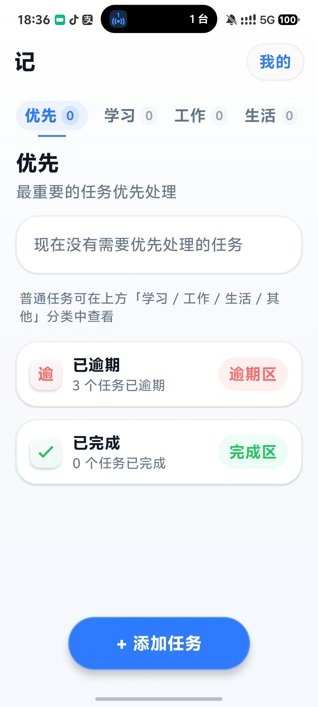
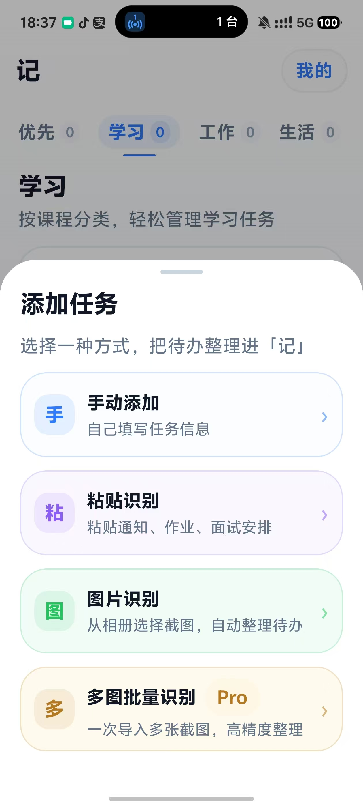
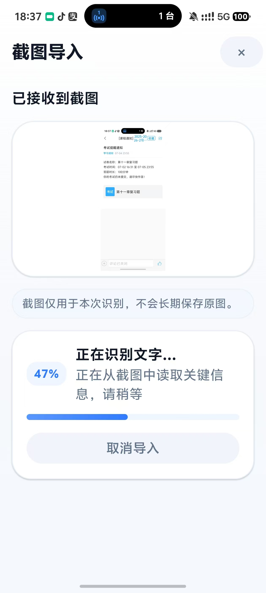
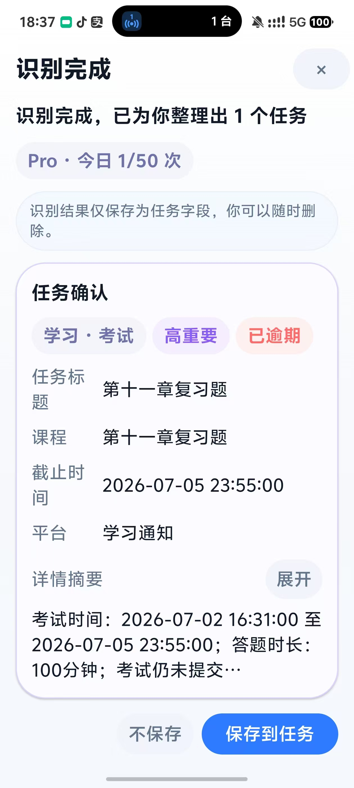

# 记 Ji

> **把你看到的信息，变成真正要执行的事情。**

「记」是一款 Android 待办整理应用。把课程通知、工作安排或生活提醒中的截图和文字交给它，提取成可确认、可管理的任务。

**[访问官网](https://primarytask.top) · [获取应用与源码构建说明](https://primarytask.top/download/)**

**截图 / 文本 → 内容理解 → 生成任务草稿 → 分类、截止时间、重要程度 → 确认保存**

图片由 AI 后端识别；粘贴文本默认在设备本地解析，也可配置远端 AI 文本解析。识别结果会先作为草稿展示，由你确认后再保存。

<p align="center">
  
  
  
  
</p>

## 适合这样的日常

- **学习**：从课程通知、作业和考试安排中提取任务与截止时间。
- **工作**：整理会议、面试和待跟进事项。
- **生活**：把缴费、取件和提醒从零散信息变成待办。

## 主要功能

- **截图整理**：选择截图上传到配置的解析后端，识别任务标题、类别、时间和重要程度；Pro 流程支持多图批量导入。
- **文本整理**：粘贴通知、作业或安排，默认使用本地规则解析；配置 `AI_TASK_PARSER_URL` 后可使用远端文本解析服务。
- **先确认，再保存**：识别结果作为草稿供你检查和编辑，确认后保存为任务。
- **按优先级管理**：按学习、工作、生活、其他分类查看任务，并查看优先任务、逾期任务和已完成任务。
- **本地任务数据**：已保存的任务存放在设备本地 Room 数据库；应用不会把任务列表同步到后端。

## 技术架构

| 部分 | 技术与职责 |
| --- | --- |
| Android | Kotlin、Jetpack Compose、Room；任务编辑、分类和本地保存 |
| Backend | FastAPI；图片校验、匿名账户与解析接口 |
| 模型接口 | OpenAI-compatible 多模态接口；配置示例使用 Qwen-VL（DashScope），默认启用 mock 模式 |

Qwen 模型、API 端点和密钥由后端部署者配置；实际服务提供方取决于部署设置。不要将服务端 API Key 写入 Android 配置、源码或 APK。

## 获取与运行

- [GitHub 源码仓库](https://github.com/oyx0416/ji)
- [项目主页](https://primarytask.top/)
- [获取应用与源码构建说明](https://primarytask.top/download/)

当前不提供预构建 APK；可从源码构建。Android 构建需要 Android Studio、JDK 17 和 Android SDK 35：克隆仓库后，在 Android Studio 中打开项目根目录并运行 `app`。图片解析默认使用项目配置的演示服务；可通过 Gradle 属性 `AI_IMAGE_TASK_PARSER_URL` 更换后端，`AI_TASK_PARSER_URL` 默认留空。

如需本地运行 Backend（Python 3.10–3.12）：

```powershell
cd backend
python -m venv .venv
.\.venv\Scripts\Activate.ps1
pip install -r requirements.txt
Copy-Item .env.example .env
python -m uvicorn main:app --host 127.0.0.1 --port 8000
```

`.env.example` 默认使用 mock 模式。接入真实模型时，在服务端配置模型端点、模型名称和 `JI_AI_MODEL_API_KEY`；生产部署还需自行配置 HTTPS、认证、日志和数据保留策略。Release 构建要求解析端点使用 HTTPS。

## 隐私与安全

- 选择图片识别时，图片会上传到构建配置中的后端；后端是否调用真实模型取决于部署配置。
- 粘贴文本默认本地解析；配置远端文本解析服务后，文本会发送到该服务。
- 任务保存在设备本地。匿名账户 Token 由 Android Keystore 保护；后端会保存账户和用量等记录。模型服务、代理和云平台的处理与留存取决于各自配置。
- 阅读[隐私说明](website/privacy/index.html)了解源码可确认的数据流程。实际部署者应按其运营和服务配置完善告知。

## 参与贡献

欢迎通过 GitHub Issues 反馈问题，或提交 Pull Request。提交前可运行 Backend 回归测试和 Android 单元测试：

```powershell
# 在 backend 目录
python -m unittest discover -s tests -v

# 在项目根目录
.\gradlew.bat test
```

## 开源许可

项目源码采用 [Apache License 2.0](LICENSE)。第三方依赖、商标及单独标注的图片素材仍受各自许可或权利约束。

如果这个项目对你有帮助，欢迎 Star ⭐
